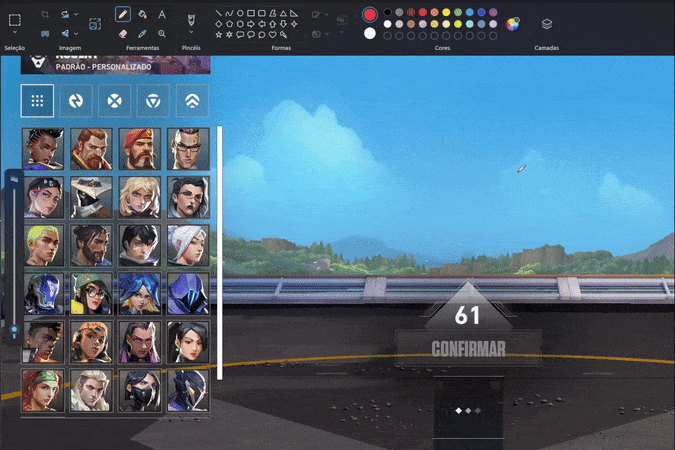

# Valorant Instalock Macro 🎯

[English](README.md) | [Português](README_PTBR.md) | [中文](README_CN.md)

Um script Python que ajuda você a selecionar agentes no Valorant. Criado apenas para fins educacionais 👀



> [!WARNING]  
> Esta ferramenta pode violar os Termos de Serviço do Valorant. Use por sua conta e risco. O criador não é responsável por quaisquer consequências.

## Funcionalidades

- Seleção fácil de agentes com teclas personalizáveis
- Suporte a múltiplos idiomas
- Processo de configuração simples
- Delay e posições de agente customizáveis
- Posições de clique com margem de erro configurável que ajudam a prevenir detecção de macro
- Simulação de movimento do mouse mais humano
- Tratamento de erros e estabilidade aprimorados
- Configurações ajustáveis para intervalos de clique e tempos de pressionamento

## Pré-requisitos

1. **Instalar Python**:

   - Baixe o Python em [python.org](https://python.org/downloads/)
   - Durante a instalação, **certifique-se de marcar** "Add Python to PATH"
   - Após a instalação, reinicie seu terminal/prompt de comando (CMD)

2. **Verificar Instalação do Python**:
   ```bash
   python --version
   ```
   Se você ver um número de versão, o Python está instalado corretamente!

## Instalação

1. **Baixar o Projeto**:

   **Opção A - Usando Git**:

   ```bash
   git clone https://github.com/yourusername/valorant-instalock
   cd valorant-instalock
   ```

   **Opção B - Sem Git**:

   - Vá para a página do repositório
   - Clique no botão verde "Code"
   - Selecione "Download ZIP"
   - Extraia o arquivo ZIP para uma pasta (ex: na Área de Trabalho)
   - Lembre-se do local da pasta (ex: `C:\Users\SeuUsuario\Desktop\valorant-instalock-main`)

2. **Navegar até a Pasta do Projeto**:

   **Opção A - Windows 11 (Forma mais fácil)**:

   - Vá até a pasta extraída
   - Clique com o botão direito em um espaço vazio dentro da pasta
   - Selecione "Abrir no Terminal"

   **Opção B - Usando Prompt de Comando**:

   - Abra o Prompt de Comando (CMD)
   - Navegue até a pasta do projeto usando o comando `cd`:

   ```bash
   # Se você extraiu na Área de Trabalho:
   cd C:\Users\SeuUsuario\Desktop\valorant-instalock-main

   # Ou se você souber o caminho completo, use-o diretamente:
   cd "caminho_para_sua_pasta_extraída"
   ```

3. **Instalar Requisitos**:

   Certifique-se de estar na pasta do projeto (onde está o `requirements.txt`) e execute:

   ```bash
   pip install -r requirements.txt
   ```

## Uso

1. **Configurações do Jogo**:

   - Recomendado: Configure o Valorant no modo "Janela em tela cheia" (Para facilitar ver a posição dos agentes)
   - Recomendado: Utilize apenas em Jogos Personalizados

2. **Executando o Script**:

   Certifique-se de estar na pasta do projeto e execute:

   ```bash
   python -m src
   ```

   Se você fechou o terminal, precisará navegar novamente até a pasta do projeto usando os passos em **Navegar até a Pasta do Projeto** acima.

3. **Primeira Configuração**:

   - Selecione seu idioma
   - Pressione F1 para começar a gravar um novo agente
   - Selecione um agente usando as setas e Enter
   - Pressione a tecla que deseja usar para esse agente (ex: DELETE, END, HOME, etc.)
   - Mova o mouse para onde o agente aparece na tela de seleção e pressione Espaço
   - Mova o mouse para o botão de Confirmar e pressione Espaço
   - Repita para outros agentes se desejar

4. **Usando o Macro**:
   - Inicie uma partida
   - Quando a seleção de agentes começar, _mantenha pressionada_ a tecla que você configurou para o agente desejado
   - Solte a tecla quando o agente estiver selecionado
   - Feche o script pressionando Ctrl+C e vença o jogo! _Sério, você já deu instalock, então por favor ganhe o jogo >:(_

## Dicas de uso

- Cada agente pode ter sua própria tecla de atalho
- Pressione ESC durante a gravação de teclas para cancelar
- O script salva sua configuração automaticamente
- **Arquivo de Configuração** (`config.json`):
  - Localizado na pasta do projeto
  - Reset fácil: Simplesmente delete `config.json` e reinicie o script
  - Totalmente personalizável:
    - Edite manualmente as teclas de atalho
    - Adicione ou remova configurações de agentes
    - Ajuste atrasos de clique na seção "delays"
    - Ajuste fino da prevenção de detecção com configurações "margin_of_error"

## Contribuindo

Sinta-se à vontade para enviar issues e pull requests!

## Propósito Educacional

Este projeto foi criado apenas para fins educacionais para demonstrar:

- Capacidades de automação em Python
- Interação com GUI
- Suporte a múltiplos idiomas
- Gerenciamento de configurações
- Manipulação de eventos

Lembre-se: Usar macros em jogos competitivos pode resultar em penalidades na conta. Use com responsabilidade!
